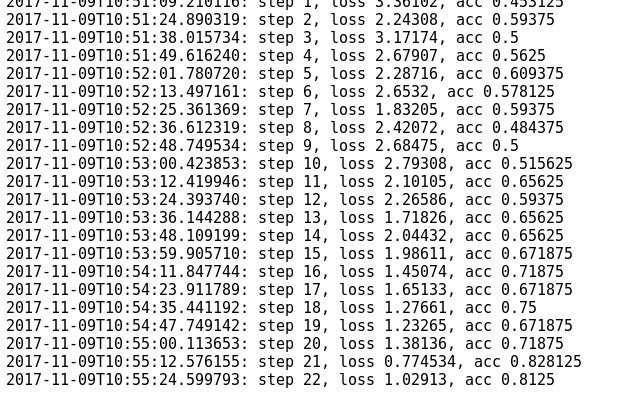
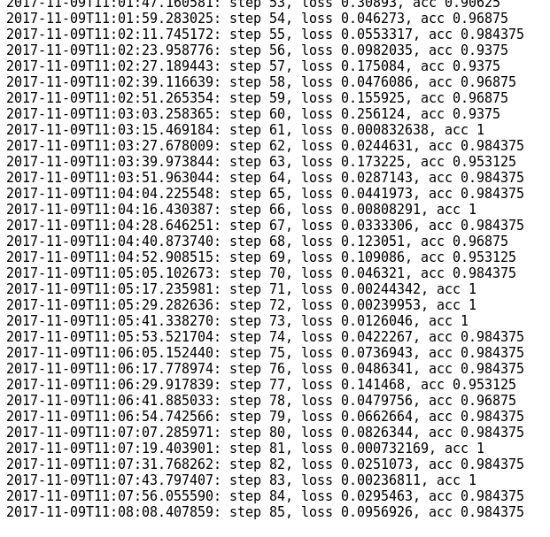
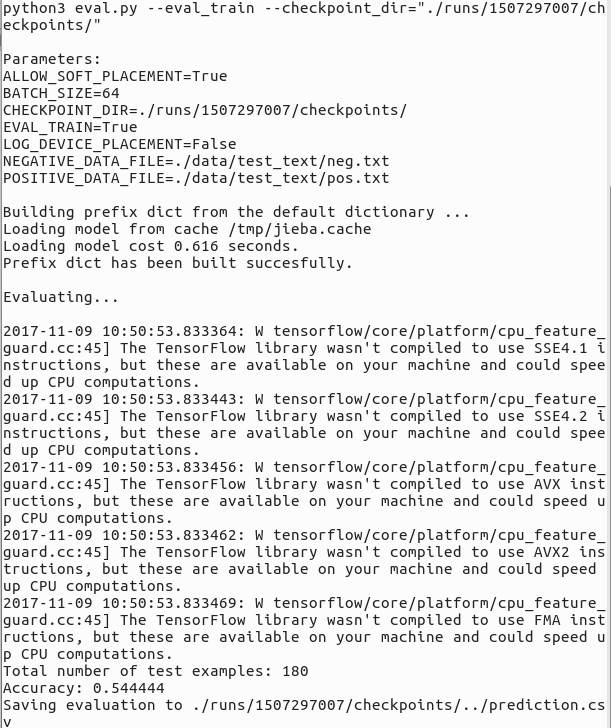

# 用卷积神经网络基于 Tensorflow 实现的中文文本分类
这个项目是基于以下项目改写：
 **[cnn-text-classification-tf](https://github.com/dennybritz/cnn-text-classification-tf)**
 
 [关于 Chinese-Text-Classification 的问题欢迎来这里提问](http://tensorflow123.com/forum.php?mod=viewthread&tid=3)

主要的改动：
* 兼容 tensorflow 1.2 以上
* 增加了中文数据集
* 增加了中文处理流程

## 特性：
* 兼容最新 TensorFlow
* 中文数据集
* 基于 jieba 的中文处理工具
* 模型训练，模型保存，模型评估的完整实现

## 训练结果





## 模型评估


以下为原项目的 README

**[This code belongs to the "Implementing a CNN for Text Classification in Tensorflow" blog post.](http://www.wildml.com/2015/12/implementing-a-cnn-for-text-classification-in-tensorflow/)**

It is slightly simplified implementation of Kim's [Convolutional Neural Networks for Sentence Classification](http://arxiv.org/abs/1408.5882) paper in Tensorflow.

## Requirements

- Python 3
- Tensorflow > 1.2
- Numpy

## Training

Print parameters:

```bash
./train.py --help
```

```
optional arguments:
  -h, --help            show this help message and exit
  --embedding_dim EMBEDDING_DIM
                        Dimensionality of character embedding (default: 128)
  --filter_sizes FILTER_SIZES
                        Comma-separated filter sizes (default: '3,4,5')
  --num_filters NUM_FILTERS
                        Number of filters per filter size (default: 128)
  --l2_reg_lambda L2_REG_LAMBDA
                        L2 regularizaion lambda (default: 0.0)
  --dropout_keep_prob DROPOUT_KEEP_PROB
                        Dropout keep probability (default: 0.5)
  --batch_size BATCH_SIZE
                        Batch Size (default: 64)
  --num_epochs NUM_EPOCHS
                        Number of training epochs (default: 100)
  --evaluate_every EVALUATE_EVERY
                        Evaluate model on dev set after this many steps
                        (default: 100)
  --checkpoint_every CHECKPOINT_EVERY
                        Save model after this many steps (default: 100)
  --allow_soft_placement ALLOW_SOFT_PLACEMENT
                        Allow device soft device placement
  --noallow_soft_placement
  --log_device_placement LOG_DEVICE_PLACEMENT
                        Log placement of ops on devices
  --nolog_device_placement

```

Train:

```bash
./train.py
```

## Evaluating

```bash
./eval.py --eval_train --checkpoint_dir="./runs/1459637919/checkpoints/"
```

Replace the checkpoint dir with the output from the training. To use your own data, change the `eval.py` script to load your data.


## References

- [Convolutional Neural Networks for Sentence Classification](http://arxiv.org/abs/1408.5882)
- [A Sensitivity Analysis of (and Practitioners' Guide to) Convolutional Neural Networks for Sentence Classification](http://arxiv.org/abs/1510.03820)

